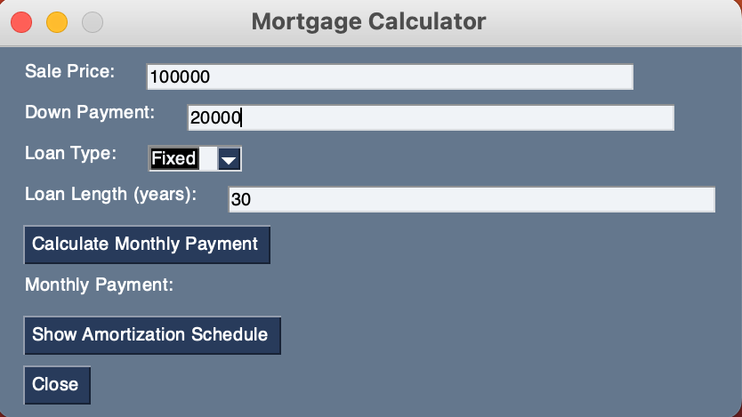
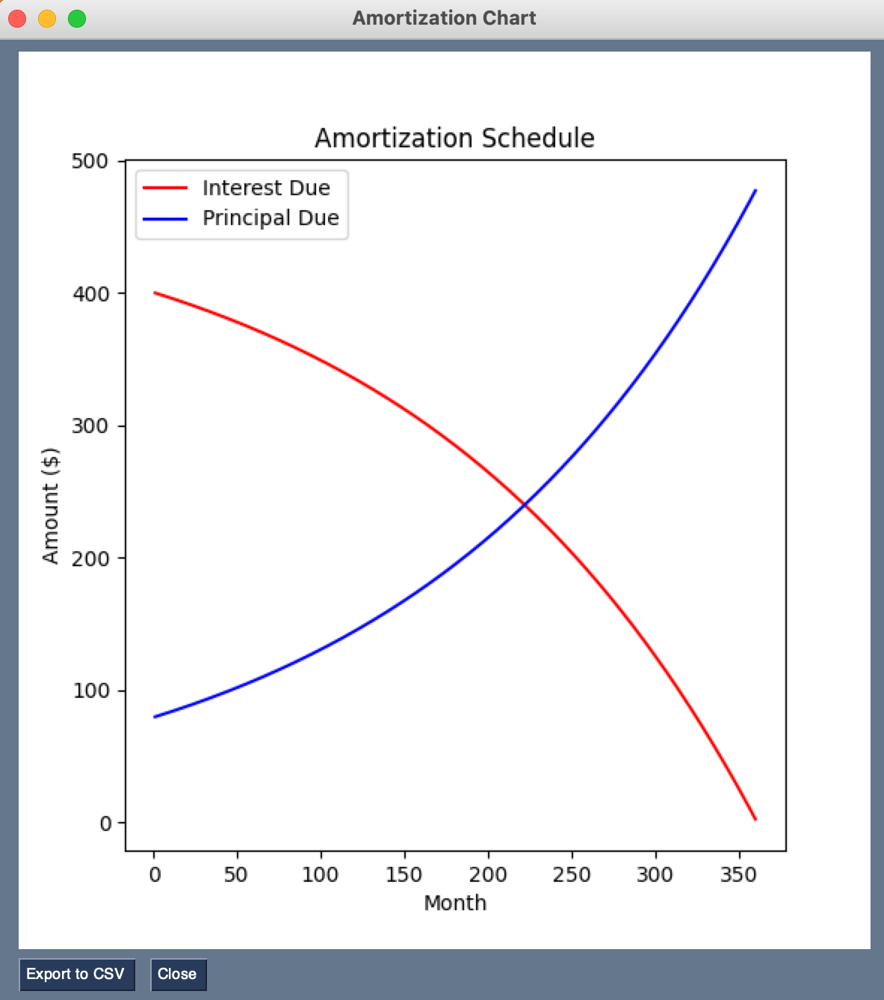

# mortgage-information
A codebase to help me make mortgage financing decisions.

## Getting Started

### Prerequisites

- Python 3.x
- pip

### Installing

1. Clone the repository
2. Install the required packages
   ```bash
   pip install -r requirements.txt
   ```
3. Run the main.py file
   ```bash
   python main.py
   ```

## Usage

Run the main.py file to start the mortgage calculator GUI and input your mortgage details.



The GUI will then display the amortization table and the monthly payment after clicking the respective buttons.



